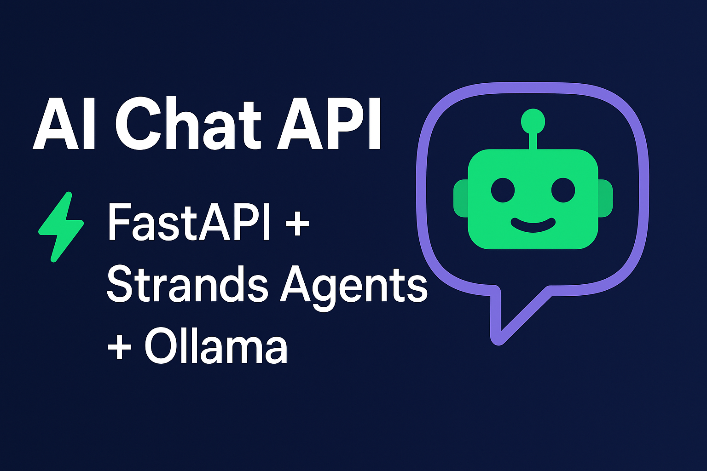

# ⚙️💬 AI Chat API — FastAPI + Strands Agents + Ollama



Este projeto implementa uma API de chat utilizando FastAPI, integrada a um Agente de IA local desenvolvido com o Strands Agents SDK e executado com modelos LLM via Ollama.

A aplicação fornece um endpoint de conversação com inteligência artificial, suporte a ferramentas personalizadas e arquitetura enxuta para uso local ou integração com sistemas maiores.

O agente possui:
- Conversação geral
- Tool personalizada para cálculos matemáticos
- Integração com FastAPI

---

## 🚀 Funcionalidades

- Endpoint `/chat` para conversação
- Uso de modelo LLM local pelo Ollama
- Tool matemática que resolve expressões
- Configuração via `.env`
- Respostas rápidas via FastAPI + Uvicorn

---

## 🧱 Requisitos

- Python 3.10+
- Ollama instalado
- Modelo local (ex.: `llama3.1`)

---

## 📦 Instalação

### 1. Instale o Ollama
Baixe em: https://ollama.com

### 2. Baixe o modelo desejado
```bash
ollama pull llama3.1
```

## 📡 Uso do Endpoint /chat

### Requisição

```bash
POST /chat
{
  "message": "Quanto é 20 * (3 + 2)?"
}
```
### Resposta (exemplo)
```bash
{
  "response": "20 * (3 + 2) = 100"
}
```

## 🛠️ Estrutura do Projeto

```bash
📁 app
 ├── agent.py        # Configuração do Agente de IA
 ├── main.py         # API FastAPI
 └── tools.py        # Tools customizadas (ex.: calculadora)
 
.env
requirements.txt
README.md
```